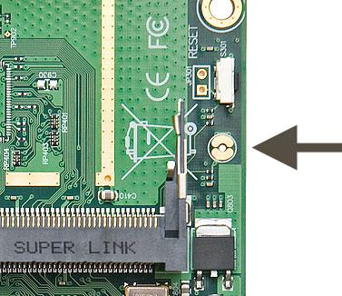

# LAB-8-Troubleshooting
Rabu 13 Agustus 2025

# Troubleshooting

**Siswa mampu melakukan troubleshooting pada mikrotik   :**  
Bagaimana troubleshooting :  
  
**a. Tidak bisa login ke mikrotik**
  1. Tombol reset, Ketika router mengalami kerusakan ringan, misal karena kesalahan setting sehingga router tidak dapat diremote. Pertolongan pertama yang bisa dilakukan adalah dengan melakukan reset konfigurasi mengunakan tombol reset.  
       

    Untuk melakukan reset konfigurasi pada routerboard bisa dilakukan dengan langkah-langkah sebagai berikut :  
    1. Lepas power adaptor.  
    2. Tekan tombol reset yang biasanya terletak di dekat power jack dengan keterangan "RES". Ada juga yang terletak dibalakang board seperti RB2011series.  
    3. Sambil tetap ditahan tombol resetnya, tancapkan power adaptornya.  
    4. Tunggu kurang lebih 5 detik, atau indikator LED ACT blink sekali, dan lepaskan tombol resetnya.  
    5. Biarkan router melanjutkan proses booting, dan router anda sudah kembali ke default konfigurasi.  
  2. Hard reset, untuk melakukan hard reset pada router anda, silahkan ikuti langkah berikut:  
       

    1. Matikan power adaptor router
    2. Sambungkan/short sisi-sisi yang terpotong jumper hole dengan pinset/obeng.
    3. Contoh reset hole seperti pada gambar dibawah
    4. Sambil tetap ditahan reset holenya, anda nyalakan power adaptor 
    5. Tunggu -+30 detik, kemudian lepaskan jumper reset hole
    6. Selesai, router sudah tereset. 
  3. Pastikan IP address di text box sudah benar, kalau pertama kali bisa masukan ip default Mikrotik **192.168.88.1** dan kalu di kolom IP nya 0.0.0.0, gunakan MAC Address untuk login.  
  4. Pastikan saat akan login username dan passwordnya sesuai, kalau pertama kali, masukan **admin** dan tanpa password.  
  5. Coba sambungkan ulang kabel LAN, atau jika masih, coba ganti kabel nya.  
  6. Jangan gunakan ether1, karna secara configurasi default, ether1 adalah WAN, dan hanya LAN yang diizinkan login oleh firewall.  
       
**b. Tidak bisa akses menggunakan winbox**  
  1. Interface Virtual masih Enable  
     Interface Virtual seperti VBOX Virtual Adapter masih nyala, coba untuk mematikan interface Virtual di Control Panel di Windows.  
       
  3. Tidak muncul di list winbox  
     a. Coba ganti kabel ethernet dan coba port lain  
     b. Reset mengunakan tombol reset  
  4. Muncul, MAC, USN, dan PASSSWD sudah benar tapi tidak bisa login  
     a. Ganti versi Winbox, jika mengunakan yang beta, coba versi yang stable nya.  
c. Tidak bisa akses melalui telnet  
  1. Pastikan Mikrotik memiliki IP, IP Default adalah **192.168.88.1**, jika belum memiliki IP, tambahkan IP Static dulu.  
  2. Pastikan IP address dan port yang dimasukan sudah benar. Defaultnya **192.168.88.1** dan port **23**  
d. Tidak bisa akses melalui ssh  
  1. Pastikan Mikrotik memiliki IP, IP Default adalah **192.168.88.1**, jika belum memiliki IP, tambahkan IP Static dulu.  
  2. Pastikan IP address dan port yang dimasukan sudah benar. Defaultnya **192.168.88.1** dan port **22**  
e. Perangkat mikrotik/RB error [indikator lampu port ethernet  menyala semuanya]  
  Penyebab masalah: kemungkinan koneksi kaki IC terputus karena korosi, menyebabkan perangkat gagal booting.  
  Solusi: pembersihan PCB, rehot IC, dan verifikasi suplai daya dapat mengembalikan fungsi normal perangkat.  
f. Mikrotik selalu restart  
  Penyebab: Firmware rusak (corrupted).  
  Solusi: Flash ulang firmware  

    1. Unduh Netinstall dan file firmware sesuai tipe perangkat dari situs resmi Mikrotik.
    2. Buka Control Panel → Network & Sharing Center → Change Adapter Settings.
    3. Pilih adapter ethernet → Properties → IPv4.
    4. Atur IP manual:
        IP: 192.168.100.7
        Subnet: otomatis (255.255.255.0).
    5. Klik kanan netinstall.exe → Run as Administrator.
    6. Atur Net Booting ke 192.168.1.1.
    7. Hubungkan kabel LAN dari port ethernet Mikrotik ke laptop.
    8. Tekan dan tahan tombol reset di Mikrotik.
    9. Sambil menahan tombol reset, colokkan kabel power.
    10. Tunggu sampai perangkat terdeteksi di Netinstall.
    11. Pilih perangkat di Netinstall.
    12. Klik Browse → pilih file firmware (.npk) yang sudah diunduh.
    13. Klik Install dan tunggu proses selesai.
    14. Cabut kabel, hubungkan kembali Mikrotik ke laptop/Winbox.
    15. Pastikan sudah terdeteksi dan tidak restart berulang.
    16. Lakukan konfigurasi ulang sesuai kebutuhan.  
  
# Kesimpulan
  Penyelesaian troubleshoot Mikrotik berbeda-beda tergantung masalahnya, ada masalah software hingga hardware. 

# Sumber  
DK SRY - Youtube: https://youtu.be/XKTOdTjqzOs?si=fKeECFW8uy47dV8u  
ARRIE CELLULAR - Youtube: https://www.youtube.com/watch?v=bDO-ZBAeV9c  
Citraweb: https://citraweb.com/artikel/58/  
SMKN3Bekasi: https://fajri.smkn3kotabekasi.sch.id/2023/08/30/negara-dengan-internet-5g-tercepat/  
BelajarMikrotik: https://belajarmikrotik.com/mikrotik-routerboard-tidak-terdeteksi-pada-winbox/  

